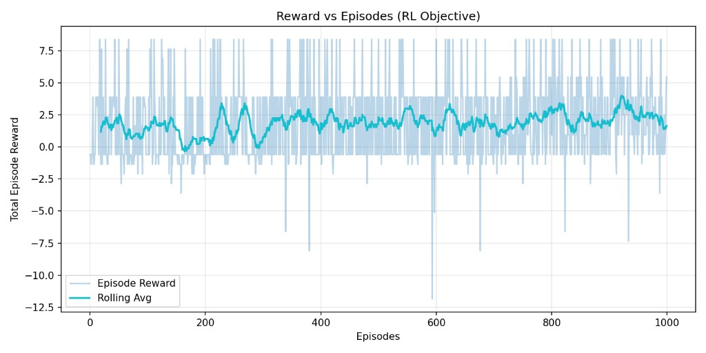
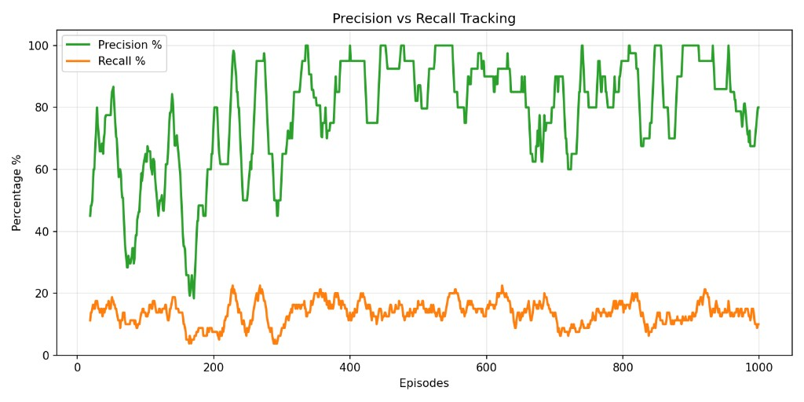
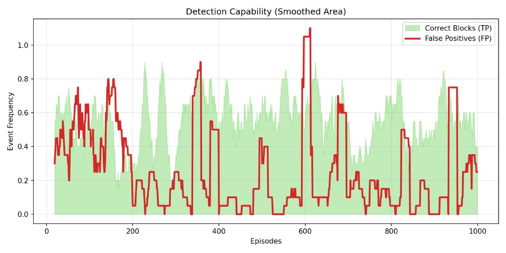
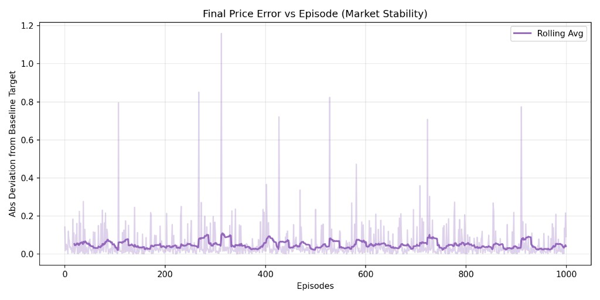

<<<<<<< HEAD
# TradeX — Multi-Agent AMM Governance Knowledge Base

TradeX is a market-surveillance and anomaly-detection system for DeFi AMMs, built as an OpenEnv-compatible reinforcement learning gym where agents learn directly through interaction. AMM markets routinely face front-running, sandwich attacks, coordinated manipulation, and MEV-style extraction; while major infrastructure players such as Uniswap, Flashbots, and other DeFi teams use private order flow, private relays, auction systems, and protocol-level mitigations, these defenses are often protocol-specific and less adaptive to emerging attack patterns. TradeX addresses that gap by enabling dynamic detection of unseen bots, novel exploit strategies, and manipulative agents, while providing a practical foundation for research, benchmarking, and deployment-oriented market integrity tooling.

It combines:

- a working PPO governance pipeline in `tradex/`
- an OpenEnv-compatible surveillance environment in `meverse/`
- reproducible evaluation and reporting workflows for benchmark analysis

This README is the main "important database" for how the system works, how to run it, and how to navigate the project.

## What TradeX Simulates

TradeX models governance under adversarial DeFi pressure:

- spoofing
- pump-and-dump behavior
- burst manipulation
- front-running style timing attacks
- MEV-like extraction behavior

## Agent Ecosystem

TradeX includes strategically coupled agents:

- **NormalTrader** -> mean-reversion / value trader
- **ManipulatorBot** -> spoof / pump-dump adversary
- **ArbitrageAgent** -> price-correcting stabilizer
- **LiquidityProvider** -> passive market maker
- **Overseer** -> governance controller (policy under training/evaluation)

Agents are not independent. One trade shifts AMM price/liquidity and changes incentives for every other participant.

## Governance Actions

Overseer response space:
=======
---
title: TradeX
emoji: 📈
colorFrom: gray
colorTo: blue
sdk: gradio
sdk_version: 4.44.1
app_file: app.py
python_version: "3.11"
pinned: false
---

# TradeX + MEVerse

TradeX started from a simple question: can we train an agent to intervene in AMM markets before manipulation cascades into full instability?

This repo now contains two connected systems:

- `tradex/`: a multi-agent AMM simulator with a PPO-trained overseer (research + training path).
- `meverse/`: an OpenEnv-compliant market-surveillance benchmark (evaluation + deployment path).

If you only read one extra page after this README, read the companion **[Hugging Face Mini Blog (`docs/hf-mini-blog.md`)](docs/hf-mini-blog.md)**.

## 1) Problem: the capability gap

Most "anomaly detection" settings are static classification tasks. Real markets are not static.

In AMM environments, one action changes price, liquidity, and incentives for every other actor. That means surveillance is not just detection. It is sequential governance under uncertainty:

- adversarial behavior can look normal for several steps,
- false positives can damage healthy flow,
- delayed intervention can amplify volatility.

TradeX/MEVerse targets that gap: train and benchmark agents that make intervention decisions over time, not one-shot labels.

## 2) Environment: what the agent sees, does, and gets rewarded for

### What the agent sees

In `meverse/`, each step provides a structured observation with market micro-signals:

- AMM price and liquidity snapshots,
- burst and pattern indicators,
- trade frequency and slippage proxies,
- suspiciousness/manipulation scores,
- episode progress metadata.

### What the agent does

In the OpenEnv benchmark (`meverse/server/meverse_environment.py`), the action space is:
>>>>>>> origin/main

- `ALLOW`
- `MONITOR`
- `FLAG`
- `BLOCK`

<<<<<<< HEAD
In PPO training, these are mapped to concrete allow/block-target decisions while keeping the broader action interface.

## Learning Loop


```text
Reset episode -> generate observations -> policy acts -> environment updates AMM state
-> reward from detection + market health -> trajectory logging -> optimization -> next episode
```

## Implementation Status

- **Implemented now (production path):** PPO training + evaluation (`tradex/`)
- **Planned/extended path:** TRL/Unsloth/GRPO-style LLM governance fine-tuning

## Quick Start
=======
Each action feeds back into future state through AMM dynamics (`meverse/amm.py`), so behavior today shifts tomorrow's distribution.

### How reward and grading work

- Step reward is shaped by action correctness and severity (`_reward_for_action`).
- Episode-level grading comes from `compute_task_grade` in `meverse/tasks.py`.
- Tasks declared in `openenv.yaml`:
  - `burst_detection`
  - `pattern_manipulation_detection`
  - `full_market_surveillance`

## 3) Results: what changed after training

The current "trained" component in this repo is the `tradex/` PPO overseer.

- PPO training pipeline: `tradex/train.py`
- Generalization benchmark: `python -m tradex.compare_generalization`
- Comparison utilities: `tradex/compare.py`, `compare_policies.py`
- Best checkpoint location: `models/best_model.pth`

In practice, training changes behavior from mostly passive allowing to targeted intervention under high-threat trajectories, with measurable movement in precision/recall/F1 and reward profiles in benchmark runs.

The OpenEnv side (`meverse/`) is the benchmark-ready environment and grader used for agent evaluation and HF deployment.

## 4) Why it matters

Who cares:

- researchers building RL/LLM agents for dynamic risk control,
- teams shipping guardrail policies for high-frequency systems,
- evaluators who need environments where actions alter future risk.

Why:

- It is a compact testbed for "monitoring as control" rather than static labeling.
- It supports both near-term baselines and longer-term LLM training pathways.
- It is reproducible enough for comparison, but rich enough to exhibit strategic/adaptive behavior.

## Architecture at a glance

```text
tradex/  -> multi-agent AMM + PPO overseer training/eval
meverse/ -> OpenEnv environment + grading + FastAPI serving
app.py   -> Gradio UI for TradeX stack
dashboard.py -> Gradio UI for MEVerse stack
inference.py -> LLM policy runner against MEVerse
openenv.yaml -> OpenEnv manifest and task registry
backend/  -> FastAPI dashboard API (wraps app.py + dashboard.py logic)
frontend/ -> React + Vite SPA replacement for both Gradio dashboards
```

For full technical mapping, see the **[Architecture Deep Dive (`docs/architecture.md`)](docs/architecture.md)**.

## Engineering table-stakes checklist

This repo currently satisfies the requested implementation constraints:

- Uses OpenEnv `Environment` base class in `meverse/server/meverse_environment.py`.
- Maintains client/server separation (`meverse/client.py` does not import server internals).
- Implements Gym-style core lifecycle (`reset`, `step`, `state`).
- Includes valid `openenv.yaml` manifest with task definitions.
- MCP/OpenEnv tool names avoid reserved runtime endpoints (`reset`, `step`, `state`, `close`).

## Run locally
>>>>>>> origin/main

```bash
pip install -r requirements.txt

# Train PPO overseer (TradeX stack)
python -m tradex.train --episodes 1000

# Evaluate generalization on unseen seeds
python -m tradex.compare_generalization
<<<<<<< HEAD
```

## Unified Pipeline (Train + Compare in One Run)

`inference.py` is now a unified runner for:

1. `tradex.train`
2. `tradex.compare_all`
3. combined final output

Run:

```bash
python inference.py --train-episodes 1000 --compare-episodes 100
```

Outputs:

- `outputs/final_combined_output.json`
- `outputs/final_benchmark.csv`

## Evaluation Workflow

The practical workflow for this repository is script-first:

1. Train PPO policy with `tradex.train`.
2. Validate with `tradex.compare_generalization` and `tradex.compare_all`.
3. Run unified benchmark packaging via `inference.py`.
4. Review exported artifacts in `outputs/` and `plots/`.

## Tasks and Difficulty

- `burst_detection` (easy)
- `pattern_manipulation_detection` (medium)
- `full_market_surveillance` (hard)

## Core Evaluation Framing

TradeX benchmarks are designed to compare:

- heuristic baseline
- always-allow/random sanity baselines
- PPO-trained overseer (current)
- TRL-style overseer variants (future path)

Primary reference command:

```bash
python -m tradex.compare_generalization
```

## Training Results (How to Read the Graphs)

### 1) Reward vs Episodes (RL objective trend)



- **What this shows:** per-episode reward (light line) and rolling average (dark line).
- **How to read it:** higher rolling average means the policy is improving expected governance decisions over time.
- **Your current signal:** rolling reward is positive and generally stable with noise, which is expected in adversarial multi-agent training.

### 2) Precision vs Recall Tracking (detection quality trade-off)



- **What this shows:** precision (green) vs recall (orange) during training.
- **How to read it:** high precision with low recall means conservative blocking (fewer false positives but more missed attacks).
- **Your current signal:** precision is strong while recall is modest, suggesting the overseer is cautious and can be tuned for better attack coverage.

### 3) Detection Capability (True Positives vs False Positives)



- **What this shows:** smoothed true positives (green area) against false positives (red line).
- **How to read it:** ideal behavior is high green with low red most of the time.
- **Your current signal:** true-positive activity dominates many windows, but red spikes indicate periodic overblocking risk.

### 4) Final Price Error vs Episode (market stability)



- **What this shows:** absolute deviation from target AMM price at episode end, plus rolling average.
- **How to read it:** lower values mean better market stability preservation under interventions.
- **Your current signal:** rolling error remains low overall, with occasional spikes during harder attack dynamics.

### Practical interpretation for judges

- The policy demonstrates **consistent positive reward learning**.
- It maintains **strong precision** (low false-alarm tendency).
- It achieves **meaningful threat interception**, though recall still has room to improve.
- It keeps **market stability largely intact** with manageable outlier episodes.

## Repository Map

- `tradex/env.py` -> AMM market environment (PPO path)
- `tradex/agents.py` -> strategic agent behaviors
- `tradex/overseer.py` -> overseer model + observation encoding
- `tradex/train.py` -> PPO training pipeline
- `tradex/compare.py` -> core evaluation routines
- `tradex/compare_all.py` -> multi-policy benchmark table output
- `tradex/compare_generalization.py` -> unseen-seed benchmark wrapper
- `tradex/reward.py` -> reward shaping logic
- `tradex/utils.py` -> logs and plots
- `meverse/server/meverse_environment.py` -> OpenEnv surveillance environment
- `inference.py` -> unified train+compare runner with combined output

## Documentation Index

- `docs/hf-mini-blog.md` -> blog-ready narrative and governance flow graphic

=======

# Run OpenEnv/FastAPI app (serves app:app as declared in openenv.yaml)
python server/app.py

# Optional UIs
python app.py
python dashboard.py
```

## Run the React dashboard

The Gradio apps still work; the React SPA in `frontend/` is an alternative UI
backed by a FastAPI service in `backend/` that re-uses the existing `meverse/`
and `tradex/` Python packages. See [`frontend/README.md`](frontend/README.md)
for details.

```bash
# Terminal 1 — FastAPI backend
pip install -r requirements.txt -r backend/requirements.txt
uvicorn backend.app:app --reload --port 8000

# Terminal 2 — React frontend
cd frontend
npm install
npm run dev          # http://localhost:5173, proxies /api to :8000
```

## Links

- **HF mini blog:** [Hugging Face Mini Blog (`docs/hf-mini-blog.md`)](docs/hf-mini-blog.md)
- **Architecture deep dive:** [Architecture Deep Dive (`docs/architecture.md`)](docs/architecture.md)

If you publish a demo video or HF post, add it here so reviewers can jump directly from the README.
>>>>>>> origin/main
