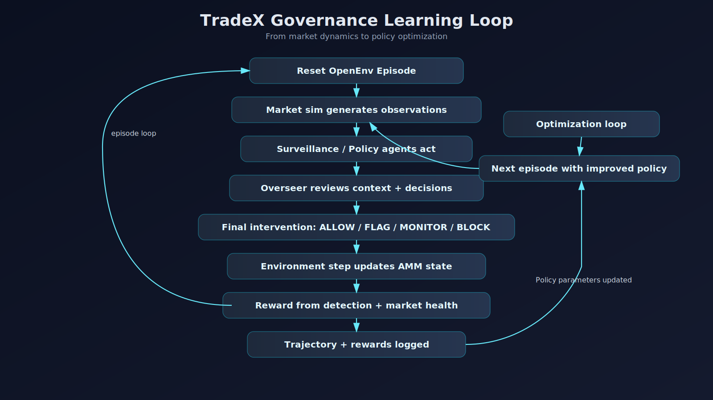

# TradeX on Hugging Face: PPO Today, TRL Pathway Next

TradeX is a multi-agent AMM governance environment where autonomous trading agents interact strategically and an Overseer learns intervention behavior from reward feedback.

The current production path in this repository is a working PPO pipeline in `tradex/`. The project is also designed to transition toward Hugging Face TRL workflows for an LLM-style Overseer without misrepresenting what is already implemented.

## Judge quick links (README)

For fast review, jump directly to these sections in the main project guide:

- [Quick Start](../README.md#quick-start)
- [Unified Pipeline (Train + Compare in One Run)](../README.md#unified-pipeline-train--compare-in-one-run)
- [Dashboard (Operational View)](../README.md#dashboard-operational-view)
- [Playground (Manual Step-Through)](../README.md#playground-manual-step-through)
- [Tasks and Difficulty](../README.md#tasks-and-difficulty)
- [Core Evaluation Framing](../README.md#core-evaluation-framing)
- [Repository Map](../README.md#repository-map)

## What to run (judge checklist)

### 1) One-command main benchmark path (`inference.py`)

From repo root:

```bash
python inference.py --train-episodes 1000 --compare-episodes 100
```

Artifacts generated:

- `outputs/final_combined_output.json`
- `outputs/final_benchmark.csv`

Quick smoke test:

```bash
python inference.py --train-episodes 10 --compare-episodes 10
```

### 2) PPO-only path (`tradex.train` + evaluation)

```bash
python -m tradex.train --episodes 1000
python -m tradex.compare_generalization
```

### 3) TRL path on Google Colab (recommended: Unsloth low-memory path)

In Colab terminal / notebook shell:

```bash
git clone https://github.com/YashAG17/TradeX-Hackathon.git
cd TradeX-Hackathon
pip install -r requirements.txt
pip install -r requirements_trl.txt
python -m tradex.train_trl --use_unsloth --episodes 30 --bootstrap_episodes 40
python -m tradex.eval_trl --episodes 50
python -m tradex.compare_all --episodes 50
```

Notes:

- `--use_unsloth` is designed for Colab VRAM/disk limits.
- Default TRL artifacts are expected under `models/trl_overseer*/final`.

## Why this matters

AMM ecosystems face adversarial behavior that can look legitimate in isolation:

- spoofing
- pump and dump
- burst manipulation
- front-running style timing attacks
- MEV-like extraction behavior

TradeX models these pressures as a governance problem under partial observability.

## Agent ecosystem

TradeX uses these roles:

- **NormalTrader** -> mean-reversion / value trader
- **ManipulatorBot** -> spoof / pump-dump adversary
- **ArbitrageAgent** -> price-correcting stabilizer
- **LiquidityProvider** -> passive market maker
- **Overseer Agent** -> governance controller

These agents are strategically coupled. One agent's trade changes AMM price and liquidity, which in turn reshapes incentives for every other agent and the Overseer.

## Multi-Agent Strategic Interaction

The Overseer observes combined market signals and must infer intent, then choose:

- `ALLOW`
- `MONITOR`
- `FLAG`
- `BLOCK`

In the current PPO stack, policy actions are implemented as allow/block-target controls, while the broader governance action space is maintained as the long-term interface.

## Current PPO Training Loop

- Environment rollouts generated
- Overseer policy acts on observations
- Rewards based on detection accuracy, false positives, and market stability
- PPO updates weights
- Best checkpoints benchmarked

`python -m tradex.compare_generalization` is currently runnable and provides benchmark output over unseen seeds.

## Future TRL Training Loop

- Same environment can emit text observations
- LLM Overseer can be fine-tuned with TRL
- Rewards from environment can optimize policy

Planned extension points include:
- Hugging Face TRL policy optimization
- Unsloth LoRA for efficient fine-tuning
- prompt optimization and GRPO-style iteration

## Governance learning flow



```text
Agents trade against each other
        ↓
AMM price / liquidity changes
        ↓
Other agents react strategically
        ↓
Market state evolves
        ↓
Overseer observes combined signals
        ↓
Chooses ALLOW / MONITOR / FLAG / BLOCK
        ↓
Environment returns reward
        ↓
PPO updates policy now
TRL updates policy later
        ↓
Smarter future governance
```

## Benchmark framing

TradeX evaluation should compare:

- Heuristic baseline
- Static prompted model (future)
- PPO-trained Overseer (current)
- TRL-trained Overseer (future)

This keeps experimentation honest: strong current PPO baseline, clear roadmap toward Hugging Face-native LLM governance training.
